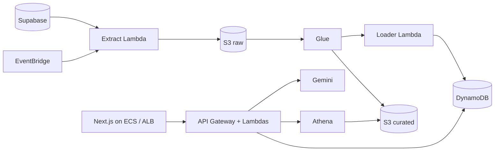

# Kallo Analytics Plane on AWS — RMIT Cloud Computing Assessment 3

## Overview

Kallo Analytics Plane is a low-cost analytics and operations layer for `kallo.fit`. It extracts privacy-reduced views from Supabase, lands raw data in Amazon S3, transforms it with AWS Glue, loads dashboard aggregates into DynamoDB, and serves them through API Gateway to a Next.js dashboard on ECS Fargate. Athena supports fixed analytical queries, while Gemini can generate a weekly operational summary.

The architecture is deliberately shaped by AWS Academy Learner Lab constraints: a USD 50 total budget, `us-east-1` only, the pre-existing `LabRole`, restricted service availability, and tight Glue and Lambda limits. The persistent data stack therefore favors scheduled batch processing and pay-per-request storage, while the costlier ALB and ECS presentation stack is disposable and should run only for development or demonstrations.

## Architecture



## Directory map

```text
infra/       CloudFormation stacks and deployment guidance
lambdas/     Extraction, loading, API, and authorizer functions
glue/        PySpark ETL job and pure transformation logic
dashboard/   Next.js analytics dashboard and local mock data
scripts/     Learner Lab deployment and teardown helpers
supabase/    Sanitized analytics-view SQL migrations
docs/        Architecture report and submission documentation
tests/       Repository-level pytest checks
```

## Quickstart

Run the Python tests:

```sh
pytest
```

Run the dashboard locally with mock data:

```sh
cd dashboard
npm install
MOCK_API=1 npm run dev
```

For AWS deployment, follow [scripts/README.md](scripts/README.md) and [infra/README.md](infra/README.md).

[docs/solution-architecture.md](docs/solution-architecture.md) is the graded report.
