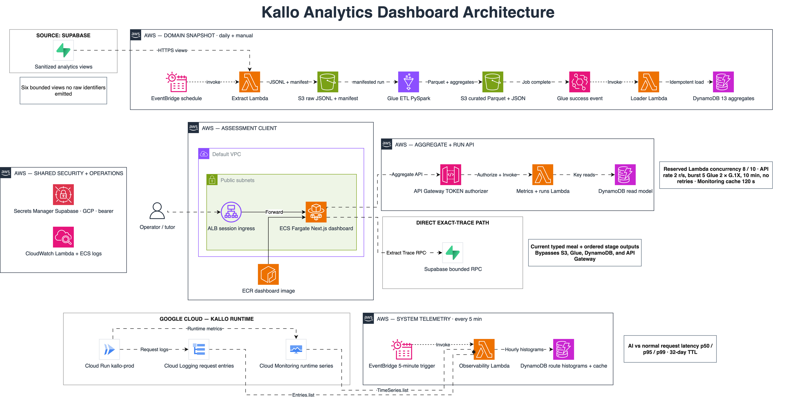
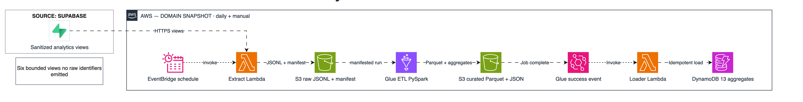
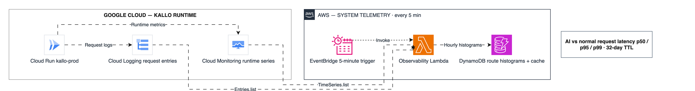
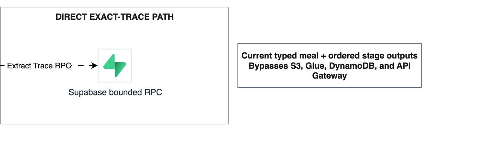

# Kallo Analytics Plane - Condensed Solution Architecture

Assessment 3 - AWS Cloud System Development  
Student: [name and student number]  
Document status: Condensed foundation for final submission

This report is written so that a reader can understand the product before seeing its cloud implementation. It first explains the operational problem and dashboard experience, then follows each client action through AWS and the two external APIs. Detailed deployment commands and the ten-minute demonstration sequence are maintained separately from the assessed report.

## Table of contents

- [1. Submission links](#1-submission-links)
- [2. From meal data to an operator view](#2-from-meal-data-to-an-operator-view)
  - [2.1 Project summary](#21-project-summary)
  - [2.2 Motivation and beneficiaries](#22-motivation-and-beneficiaries)
  - [2.3 Operator views](#23-operator-views)
- [3. Related work and design position](#3-related-work-and-design-position)
- [4. Architecture and automated client operations](#4-architecture-and-automated-client-operations)
  - [4.1 Authenticated client path](#41-authenticated-client-path)
  - [4.2 Product analytics: Supabase to S3, Glue, and DynamoDB](#42-product-analytics-supabase-to-s3-glue-and-dynamodb)
  - [4.3 System telemetry: Google APIs to bounded AWS storage](#43-system-telemetry-google-apis-to-bounded-aws-storage)
  - [4.4 Exact meal diagnosis through a restricted RPC](#44-exact-meal-diagnosis-through-a-restricted-rpc)
- [5. Purpose of the cloud components](#5-purpose-of-the-cloud-components)
- [6. Data structures and API usage](#6-data-structures-and-api-usage)
  - [6.1 Data contracts](#61-data-contracts)
  - [6.2 AWS and external API contracts](#62-aws-and-external-api-contracts)
- [7. Metric meaning, freshness, and interpretation](#7-metric-meaning-freshness-and-interpretation)
- [8. Security, reliability, and cost decisions](#8-security-reliability-and-cost-decisions)
  - [8.1 Security controls](#81-security-controls)
  - [8.2 Reliability controls](#82-reliability-controls)
  - [8.3 Cost controls](#83-cost-controls)
- [9. Validation, limitations, and future direction](#9-validation-limitations-and-future-direction)
- [10. Conclusion](#10-conclusion)
- [References](#references)

## 1. Submission links

| Item | Submission |
| --- | --- |
| Live AWS application | [Insert the Application Load Balancer URL used during the assessed demonstration.] |
| Permanent testing link | [Insert the stable testing URL.] This is a continuity workaround for short-lived AWS Academy Learner Lab sessions, not evidence for an assessed AWS service. |
| Source repository | [Insert the accessible repository URL. Credentials and private production data are excluded.] |
| Public datasets | [Insert the final USDA/FAO-derived dataset URLs or state why production data is not redistributed.] |
| Architecture diagram | [Editable diagrams.net source](https://app.diagrams.net/#G1TqQk6uwBnSJZzMt_e5K5YvQTOjBnv7mE%23%7B%22pageId%22%3A%22d%22%7D) |

## 2. From meal data to an operator view

### 2.1 Project summary

Kallo is a text-first nutrition tracker. A person types a meal in natural language, and the product turns it into structured ingredients and nutrition data through an AI-assisted retrieval pipeline. Kallo Analytics Plane is a private dashboard built around that production system. Its purpose is to help an operator understand product activity, AI behaviour, ingredient coverage, exact meal-analysis traces, and Cloud Run health without exposing unrestricted production data.

The assessed client is a Next.js container on Amazon Elastic Container Service (ECS) with AWS Fargate, reached through an Application Load Balancer (ALB). Authenticated server routes call Amazon API Gateway and narrowly scoped AWS Lambda functions. Product analytics are materialised through Amazon S3, AWS Glue, and Amazon DynamoDB, while current system telemetry comes from Google Cloud Monitoring and Cloud Logging. Supabase provides restricted product views and bounded trace functions.

### 2.2 Motivation and beneficiaries

Kallo's main application was already functional, but its operational evidence was spread across database queries, AI logs, and cloud-provider consoles. An uptime check could not show whether normal endpoints or AI meal analysis were slow. It also could not explain a rise in token cost, an ingredient coverage gap, or the stages of one failed meal request. The dashboard brings these questions into one consistent interface and turns raw technical signals into charts, tables, and compact trace views.

The founder uses the dashboard to monitor reliability, adoption, and model cost. Product engineers can separate HTTP latency, recorded pipeline latency, model failures, and container startup. Food-data maintainers can inspect frequent ingredient demand, accepted candidates, gaps, and suspicious nutrition records. The architecture also gives an assessor a complete path from a client action to automated AWS processing and an interpretable result.

### 2.3 Operator views

| Page | Main source | Operator question |
| --- | --- | --- |
| Today | Latest completed DynamoDB snapshot | Is anything unusual across product activity, application health, or AI cost? |
| AI | DynamoDB product aggregates | How are calls, pipeline latency, failures, tokens, and estimated cost changing? |
| Ingredients | DynamoDB product aggregates | Which ingredients are requested, matched, rejected, or missing from the catalogue? |
| System | Google Monitoring plus DynamoDB route histograms | Is Cloud Run healthy, and are normal or AI requests slow? |
| Trace Viewer | Restricted Supabase RPCs | What did a person type, and what happened at each stage of that meal request? |

This sequence is intentionally simple: Today answers "Is anything unusual?", the domain pages answer "Where is it happening?", and Trace Viewer answers "What happened in this request?" A shared time-window control keeps comparisons consistent. Line charts use the full content width, while tables paginate dense ingredient and trace data.

## 3. Related work and design position

Cloud-provider consoles, Grafana-style observability tools, and general business-intelligence dashboards solve parts of the same problem. Google Cloud already exposes strong infrastructure time series, while Supabase exposes PostgreSQL data through its Data API. These tools remain useful for engineering diagnosis, but they do not understand Kallo's meal pipeline, ingredient matching decisions, or privacy boundary.

Kallo Analytics Plane therefore acts as a domain-specific operations layer rather than a replacement for every cloud console. Provider-native metrics remain the source for Cloud Run health. AWS provides the automated extraction, transformation, serving, and presentation path required by the assignment. Exact traces stay close to Supabase because copying every raw trace into AWS would increase privacy risk and make request-level diagnosis stale.

The scope deliberately excludes Amazon Athena and an additional Gemini summary feature. Athena would query curated files, but the dashboard already reads bounded aggregates from DynamoDB and does not need ad hoc SQL. A generated weekly summary would add another AI call without improving the core monitoring questions. Gemini model names, token counts, failures, latency, and estimated cost remain observed product data, not a separate report-generation API.

## 4. Architecture and automated client operations

*Figure 1. Kallo Analytics Plane assessed runtime architecture.*

### 4.1 Authenticated client path

During an assessment session, the operator opens the ALB URL. The ALB health-checks and forwards traffic to the Next.js task on ECS/Fargate. Login creates an HMAC-signed, HttpOnly, SameSite=Strict session with founder or reviewer permissions. When a page needs AWS data, a same-origin Next.js server route adds a server-held bearer token and calls API Gateway. A Lambda TOKEN authorizer validates the request before API Gateway applies routing, throttling, and quota controls.

This server facade keeps AWS and external-service credentials out of browser JavaScript. It also gives the user one consistent application even though the underlying panels use different freshness models. Read-only reviewers can inspect data, while founder-only routes can start a batch snapshot.

### 4.2 Product analytics: Supabase to S3, Glue, and DynamoDB

*Figure 2. Product-analytics batch flow extracted from the full architecture.*

The product snapshot follows one automated publication boundary:

1. EventBridge invokes the extract Lambda approximately every 24 hours, or a founder starts the same operation through `POST /runs`.
2. The extractor reads six sanitised Supabase views through HTTPS/PostgREST and writes JSON Lines plus a manifest to a run-specific S3 prefix.
3. The extractor starts one Glue job with that exact manifest location.
4. Glue performs deterministic PySpark transformations, writes curated Parquet, and materialises thirteen bounded aggregate JSON contracts.
5. A success-only EventBridge rule invokes the loader Lambda, which validates and idempotently replaces the corresponding DynamoDB snapshots.
6. API Gateway invokes the metrics Lambda, which accepts only allow-listed metric names and filters the newest complete snapshot to the chosen display window.

Failed Glue jobs update run state but never publish partial aggregates.

Glue is more than a Data Transfer Object (DTO) mapper in this path. A DTO could rename one response, but it would not join several source views, preserve immutable run manifests, produce reusable Parquet, or enforce a success-only publication boundary. Glue would be excessive for one small display-ready response; it is appropriate here because the report needs a repeatable multi-source analytics job. S3 provides the durable raw and curated boundary, while DynamoDB gives the dashboard predictable reads.

### 4.3 System telemetry: Google APIs to bounded AWS storage

*Figure 3. System-telemetry flow extracted from the full architecture.*

The System page follows two coordinated paths:

- On a cache miss or explicit refresh, the observability Lambda uses a read-only Google service account from Secrets Manager to query Cloud Monitoring for Cloud Run traffic, 5xx responses, request latency, startup latency, CPU, memory, and instance count.
- Every five minutes, EventBridge invokes a bounded Cloud Logging collector that classifies exact `POST /api/analyze-meal` entries as AI traffic and other valid application paths as normal traffic.
- Monitoring responses are cached for 120 seconds; hourly route histograms are retained in DynamoDB for 32 days.
- The response merges provider-native Monitoring series with route-separated histogram summaries.

Cloud Run's built-in route label is empty for this service, which is why the bounded Logging collector performs the AI-versus-normal classification. AWS stores only counts, latency bounds, sums, bucket counts, ingestion time, and expiry; it does not copy URLs, request bodies, users, sessions, or raw log entries.

The System response merges provider-native Monitoring series with these route histograms. A one-time bounded backfill populated retained history, and subsequent collection overlaps recent hours so late logs are included. A 32-day Time to Live (TTL) safely covers the 30-day dashboard window.

### 4.4 Exact meal diagnosis through a restricted RPC

*Figure 4. Exact trace path extracted from the full architecture.*

Trace Viewer does not use the batch pipeline:

1. The list page calls the allow-listed Supabase function `analytics_requests_page` for the selected window.
2. The table displays the bounded original meal description rather than an aggregation of extracted items.
3. Selecting a meal opens `/trace/{requestId}`.
4. The server calls `analytics_trace_detail` and renders ordered stages, timings, and compact structured outputs on a dedicated page.

This direct path is intentional. Request-level diagnosis needs current detail, while S3 and Glue produce delayed aggregates. The browser never receives the Supabase credential, user or session identifiers, request context, prompts, images, wire responses, or unrestricted rows.

## 5. Purpose of the cloud components

| Service | Implemented responsibility | Why it is justified |
| --- | --- | --- |
| ALB | Routes assessed HTTP traffic and checks ECS target health. | Provides the visible AWS ingress and separates public routing from the container task. |
| ECS/Fargate and ECR | Runs the versioned Next.js Linux image without a user-managed EC2 server. | Keeps deployment reproducible while avoiding server maintenance. |
| API Gateway | Exposes authenticated REST routes with throttling, quota, CORS, and Lambda proxy integration. | Creates one controlled API boundary for the dashboard. |
| Lambda | Implements authorization, extraction, loading, aggregate reads, run control, and Google telemetry collection. | Fits short, event-driven operations with separate responsibilities. |
| S3 | Stores raw JSONL, immutable manifests, curated Parquet, aggregate JSON, and Glue code. | Creates a durable and auditable boundary between pipeline stages. |
| Glue | Joins and transforms sanitised sources into reusable curated and aggregate outputs. | Makes the multi-source transformation repeatable and success-gated. |
| DynamoDB | Serves thirteen aggregate contracts, run state, guards, short caches, and route histograms. | Provides predictable keyed reads without scanning production data. |
| EventBridge | Schedules daily snapshots and five-minute log ingestion; routes Glue completion events. | Automates the system without keeping a worker running. |
| Secrets Manager | Stores Supabase, Google, API, and dashboard secrets outside code and images. | Centralises secret handling at runtime. |
| CloudWatch | Records Lambda/ECS logs and native AWS metrics. | Provides evidence and diagnosis for the assessed AWS runtime. |

AWS Academy requires the shared `LabRole`; in a normal account, each Lambda would receive a separate least-privilege role.

## 6. Data structures and API usage

### 6.1 Data contracts

The six Supabase analytics views cover meal activity, AI calls, ingredient decisions, food composition, application-health events, and related transformation inputs. They are privacy-reduced at the database boundary. Aggregate output contains no raw person, session, request, meal, or telemetry-event identifier. A keyed user hash exists only inside Glue for distinct daily and weekly activity counts and is never emitted.

S3 paths are run-specific: `raw/<source>/dt=<date>/run=<id>/`, `raw/_manifests/`, `curated/<dataset>/`, and `aggregates/<metric>.json`. This structure prevents files from different generations from being mixed. The manifest, rather than a "latest file" lookup, is the hand-off contract between extraction, Glue, and loading.

| Store | Key or layout | Purpose |
| --- | --- | --- |
| S3 raw | `raw/<source>/dt=<date>/run=<id>/` plus manifest | Preserves one immutable source generation. |
| S3 curated | `curated/<dataset>/` and `aggregates/<metric>.json` | Holds reusable Parquet and bounded Glue outputs. |
| DynamoDB aggregates | `metric` plus observation date | Serves product charts and tables by known key. |
| DynamoDB operations | Run IDs, a 30-minute run guard, cache keys, and UTC histogram hours | Coordinates runs, refresh caching, and route-latency history. |

### 6.2 AWS and external API contracts

| Route | Method | Result |
| --- | --- | --- |
| `/metrics/{metric}` | GET | Returns one allow-listed DynamoDB aggregate filtered to the requested window. |
| `/runs` | POST | Starts a founder-only snapshot or returns the active global run guard. |
| `/runs/{run_id}` | GET | Reports extract, Glue, load, success, or failure state. |
| `/cloud-monitoring` | GET | Returns cached or refreshed Monitoring series merged with stored route histograms. |

The exact trace RPC remains behind a same-origin Next.js route because it is already restricted at the database-function and server layers. Adding another proxy would add latency without improving the aggregate API boundary.

The first external integration is **Supabase PostgREST/RPC**. PostgREST supplies sanitised views to the extractor, while two migration-controlled database functions provide bounded trace list and detail results. The second integration is **Google Cloud Monitoring and Logging APIs**. The Monitoring API supplies provider-generated time series; the Logging API supplies retained request entries needed for route classification. Both integrations are called automatically by deployed code, which satisfies the assignment definition of an implemented API rather than a manual console export.

The Google reader holds only `roles/monitoring.viewer` and `roles/logging.viewer` in the target project. Billing export is not used. AI operating cost is estimated from recorded input and output tokens multiplied by configured per-model rates. Unknown pricing is marked as unknown rather than treated as free, and the result is never labelled as an invoice.

## 7. Metric meaning, freshness, and interpretation

| Metric | Source and measurement boundary | Freshness |
| --- | --- | --- |
| Normal API latency | Cloud Logging duration for valid application requests other than exact `POST /api/analyze-meal`. | Five-minute collector; retained as hourly histograms. |
| Cloud Run AI endpoint latency | Complete HTTP duration for exact `POST /api/analyze-meal`, including failures and platform/framework overhead. | Five-minute collector; retained as hourly histograms. |
| Recorded AI pipeline latency | Application-written `pipeline_runs.total_ms`, grouped by UTC day and terminal model. | Latest successful batch snapshot. |
| Container startup latency | Provider-native Cloud Monitoring distribution for new Cloud Run instances. | Live query, subject to the 120-second cache. |

These charts do not use the same population or boundary, so they should be compared only after selecting the same time window.

Very low AI endpoint points can represent requests rejected early with statuses such as 400, 401, or 429. A fast failure is still a real HTTP request but does not mean the meal pipeline completed quickly. The chart should therefore be interpreted with traffic and response-code data; a future refinement can show successful and failed endpoint latency as separate series. A latency spike may coincide with container startup when minimum instances are zero, but correlation with the startup chart does not prove causation.

Route percentiles use mergeable histograms. Each hourly route summary counts observations in fixed millisecond ranges that double from 1 ms to 128 seconds. To estimate p95 or p99, the collector finds the bucket containing the target rank and interpolates between that bucket's bounds, then clamps the result to the observed minimum and maximum. The exact request value is not retained, so the percentile is an estimate. At low traffic, p95 and p99 often occupy the same top bucket and can overlap. At higher traffic, the estimate becomes statistically steadier, although bucket width still limits precision.

Freshness follows the source, not the login session.

| Action | Source contacted | Can it create newer data? |
| --- | --- | --- |
| Run snapshot | Supabase → S3 → Glue → DynamoDB | Yes. It publishes new product aggregates after Glue succeeds. |
| Refresh on Today, AI, or Ingredients | DynamoDB | No. It re-reads the newest completed snapshot. |
| Refresh on System | Google Monitoring plus DynamoDB route histograms | Partly. It bypasses the Monitoring cache, but histogram freshness still follows the five-minute collector. |
| Refresh on Trace Viewer | Restricted Supabase RPC | Yes. It re-queries current bounded trace data. |

Logging out removes only the browser session; it does not clear DynamoDB, Google telemetry, Supabase data, or either EventBridge schedule.

Google alignment is chosen to match the display window. Up to seven days uses one-hour alignment, while 30 days uses six-hour alignment. Counts are summed. Instance count uses mean alignment before cross-series summation because Cloud Run emits active, idle, and revision series separately; summing independent maxima could invent a peak that never occurred at one time.

## 8. Security, reliability, and cost decisions

### 8.1 Security controls

- Browser traffic remains same-origin; AWS and external-service secrets never enter browser JavaScript.
- Founder and reviewer sessions are HMAC-signed, HttpOnly, and SameSite=Strict.
- Mutating routes require founder permission and a matching origin.
- Supabase views, RPC names, and AWS metric names are allow-listed.
- Google access is read-only, S3 blocks public access, and secrets remain in Secrets Manager.
- DynamoDB stores no raw log body, prompt, image, actor identifier, or unrestricted trace.

### 8.2 Reliability controls

- Immutable manifests bind every Glue run to one source generation.
- Success-only loading prevents partial aggregates from becoming visible.
- Conditional writes and idempotent replacement make retries safe.
- A global run guard stops duplicate manual batches across browsers and devices.
- Recent log hours are re-read to capture late entries.
- The UI distinguishes loading, empty, unavailable, and stale states from a valid zero.

### 8.3 Cost controls

- Lambda reserved concurrency totals eight of the ten available Learner Lab lanes.
- API Gateway is capped at 2 requests per second, a burst of 5, and a monthly quota.
- Glue uses two G.1X workers, a ten-minute timeout, one concurrent job, and no automatic retry.
- DynamoDB uses on-demand capacity; Monitoring results are cached for 120 seconds; route summaries expire through TTL.
- The ALB/Fargate presentation tier is created for assessment sessions and removed afterward.
- A stable external testing mirror provides continuity without being claimed as AWS deployment evidence.

## 9. Validation, limitations, and future direction

The project is defined through CloudFormation as a persistent data stack and a disposable presentation stack. Deployment scripts package Lambda code, upload Glue sources, update the stacks, build and push the dashboard image, and start or stop ECS/ALB. Automated checks cover Python tests, TypeScript, the production Next.js build, CloudFormation linting, shell syntax, and diagram validation. Demonstration evidence should pair each visible dashboard action with the corresponding AWS console page and CloudWatch log, while credentials and account identifiers remain redacted.

The current design is appropriate for assessment traffic, not unlimited growth. Future work should:

- replace retained-log polling with route-labelled OpenTelemetry histograms or streaming aggregation;
- retain sampled exact traces for diagnosis without copying unrestricted production data;
- version histogram boundaries before changing them because incompatible bucket definitions cannot be merged safely; and
- store older telemetry at a coarser resolution only when a capacity-planning requirement justifies it.

## 10. Conclusion

Kallo Analytics Plane uses AWS as an automated analytics and serving system rather than a collection of console-created resources. Lambda and API Gateway form the control plane, S3 and Glue create a repeatable batch boundary, DynamoDB serves bounded results, EventBridge keeps both analytics and telemetry moving, and ECS/Fargate with ALB provides the assessed client deployment. Supabase supplies restricted product data and exact traces, while Google APIs supply provider-native health and retained request evidence.

Separating batch aggregates, current system telemetry, and exact diagnosis makes the system easier to explain and safer to operate. Each dashboard page has a clear question, each refresh action has a precise meaning, and each cloud component has a reason to exist. This structure also lets the assessor understand the product before following the detailed service interactions.

## References

[1] Amazon Web Services, “AWS Lambda concepts,” *AWS Lambda Developer Guide*.

[2] Amazon Web Services, “What is Amazon API Gateway?,” *Amazon API Gateway Developer Guide*.

[3] Amazon Web Services, “AWS Glue: How it works,” *AWS Glue Developer Guide*.

[4] Amazon Web Services, “What is Amazon DynamoDB?,” *Amazon DynamoDB Developer Guide*.

[5] Amazon Web Services, “What is Amazon Elastic Container Service?,” *Amazon ECS Developer Guide*.

[6] Google Cloud, “Filtering and aggregation: manipulating time series,” *Cloud Monitoring Documentation*.

[7] Google Cloud, “Cloud Run metrics,” *Cloud Run Documentation*.

[8] Google Cloud, “Method: entries.list,” *Cloud Logging API v2*.

[9] Supabase, “Database Functions,” *Supabase Documentation*.

[10] PostgreSQL Global Development Group, “CREATE FUNCTION,” *PostgreSQL Documentation*.
