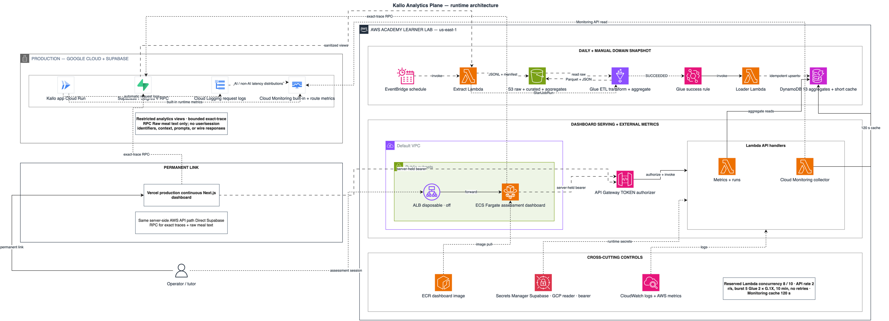

# Kallo Analytics Plane — solution architecture

## 1. Purpose and final scope

Kallo Analytics Plane is a private operator dashboard for `kallo.fit`. It explains product-domain aggregates, AI meal-call behavior, exact per-meal traces, and application-wide Cloud Run health. A trace may expose only the bounded meal description that the person typed; user/session identifiers, request context, prompts, and model wire responses remain excluded.

The final design deliberately omits Amazon Athena and the generated Gemini weekly-summary feature. Both were technically possible, but neither improved the dashboard enough to justify another service path, permission surface, failure mode, and explanation during assessment. Gemini remains the model used by the Kallo product; its observed model name, token counts, latency, failures, and estimated token cost are analytics data rather than a second summary integration.

The two fully automated third-party API integrations are:

1. Supabase PostgREST/RPC for restricted analytics extraction and bounded exact-trace lookup.
2. Google Cloud Monitoring API for Cloud Run request and runtime metrics.

No Google billing API is used. AI cost is an estimate derived from recorded input/output tokens and the configured per-model rates. It is labeled as an estimate and is not presented as a cloud invoice.



The editable source is [kallo-analytics-architecture.drawio](doc_images/kallo-analytics-architecture.drawio). A wider deployment view is available in [kallo-cross-platform-topology.drawio](doc_images/kallo-cross-platform-topology.drawio).

## 2. Data paths

### 2.1 Domain aggregate path — Supabase to Glue

1. EventBridge invokes the extract Lambda daily, or a founder starts the same path through `POST /runs`.
2. The extract Lambda reads six sanitized Supabase views through HTTPS. The restricted JWT and gateway key are held in Secrets Manager.
3. It writes JSON Lines and a manifest to a run-specific S3 raw prefix, then starts one Glue job.
4. Glue reads only the manifested run, applies deterministic transformations, writes the latest complete curated Parquet snapshot, and writes thirteen aggregate JSON payloads.
5. An EventBridge rule reacts only to `SUCCEEDED` for the named Glue job and invokes the loader Lambda.
6. The loader performs idempotent DynamoDB upserts using `metric` as the partition key and an observation date/hour as the sort key.
7. API Gateway invokes the metrics Lambda, which returns only supported metric names and filters rows to the requested observation window.

Glue is useful here because the application has a real batch boundary: several sanitized source views are transformed together into stable, repeatable aggregate contracts. A hand-written DTO would only rename or reshape one response; it would not provide manifested runs, distributed file transforms, curated Parquet, success-triggered loading, or an auditable raw-to-aggregate boundary. If the source were already one small, ready-to-display response, Glue would be excessive. In this design it is the transformation service being demonstrated, not a pass-through mapper.

### 2.2 System path — Google observability to DynamoDB

1. The System page calls the dashboard's same-origin `/api/cloud-monitoring` route with `from`, `to`, and optional `refresh` parameters.
2. The Next.js server calls the authenticated API Gateway route with the server-held bearer token.
3. API Gateway invokes the Cloud Monitoring collector Lambda.
4. On a cache miss or explicit refresh, the Lambda uses a service-account credential from Secrets Manager and the narrow Monitoring read scope to query Google Cloud Monitoring for Cloud Run request count, 5xx count, startup-latency p95, CPU p95, memory p95, and average instance count. Instance-count state and revision series are mean-aligned before summing so active and idle peaks from different minutes are not double-counted.
5. Separately, EventBridge invokes the same collector every five minutes. The collector reads Cloud Run request-log entries through the Cloud Logging API, classifies exact `POST /api/analyze-meal` requests as AI and all other paths as non-AI application traffic, and replaces idempotent hourly histogram buckets in DynamoDB.
6. Only count, latency bounds, sum, and fixed bucket counts are stored. Raw request logs, URLs, user identifiers, and bodies are not copied into AWS. A 32-day DynamoDB TTL safely covers the dashboard's 30-day window.
7. The System response combines the briefly cached Monitoring series with the persisted route histograms and derives p50/p95/p99 for the selected display alignment. A one-time bounded backfill populated the initial history; subsequent collection is incremental.

The Google service account is granted only `roles/monitoring.viewer` and `roles/logging.viewer` in project `cal-487315`. The monitored service is `kallo-prod` in `asia-southeast1`. The key is kept outside the repository with owner-only permissions.

The System page therefore has separate p50/p95/p99 timelines for non-AI application traffic and the complete AI meal HTTP request. The latter includes retrieval, model calls, and assembly. It remains distinct from AI model latency, which measures only an individual Gemini call inside the request. Cloud Logging retains the source request entries, so the collector can fetch the chosen historical window while logs remain available; unlike a newly created logs-based metric, this design can backfill retained entries. Container startup remains a separate chart.

### 2.3 Exact AI-meal trace path

Exact traces answer “what happened in this one AI meal call?” They are not an aggregate and are not sent through S3, Glue, or DynamoDB.

1. The AI page selects a bounded trace identifier from the restricted trace list.
2. The Next.js server calls one allow-listed Supabase RPC with that identifier.
3. The RPC returns the ordered pipeline stages and bounded diagnostic fields.
4. The browser renders stage timing, compact structured output, and the bounded original meal text. It never receives the Supabase credential, user/session identifiers, request context, prompts, or model wire responses.

An empty successful RPC response means no eligible trace rows currently exist; it is not treated as an outage.

## 3. Dashboard information architecture

The active pages are:

| Page | Main source | Purpose |
| --- | --- | --- |
| Today | Glue aggregates in DynamoDB | Daily/weekly context and current aggregate snapshot |
| AI | Glue aggregates plus exact-trace RPC | AI-call volume, model latency, failures, tokens, estimated cost, and one-call trace detail |
| Ingredients | Glue aggregates in DynamoDB | Consolidated retrieval, mapping, coverage, corpus, gap, and rank evidence |
| System | Google Monitoring plus persisted Cloud Logging histograms | Separate non-AI and AI-request latency, traffic, 5xx, startup, CPU, memory, and average instances |

Pipeline Overview is removed. Retrieval and Coverage routes redirect to the consolidated Ingredients page. Line charts always use the full content width. Model-level token and failure details are carried in timeline tooltips instead of separate side-by-side charts. Every chart and summary is filtered to the chosen 24h/7d/30d window.

Direct-API pages expose Refresh. Glue-only views rely on the manual snapshot action because reloading a browser cannot create a newer batch aggregate.

## 4. AWS service responsibilities

| Service | Implemented responsibility | Why it is justified |
| --- | --- | --- |
| AWS Lambda | Extract, load, metric reads, run start/status, Cloud Monitoring collection, TOKEN authorization | Each function has a narrow handler, timeout, memory size, and reserved concurrency. Lambda is a principal assessed compute service. |
| Amazon API Gateway | Authenticated REST boundary for metrics, runs, and Cloud Monitoring | Central routing, throttling, quotas, CORS, and Lambda proxy integration; also a principal assessed service. |
| Amazon ECS on Fargate | Runs the Next.js dashboard container for AWS evidence | Demonstrates managed container deployment without operating EC2 instances; presentation-only and disposable. |
| Application Load Balancer | Gives the ECS task a stable session URL and performs target health checks | Required ingress for the Fargate demonstration, but kept off outside assessment sessions due to hourly cost. |
| Amazon S3 | Raw JSONL, manifests, curated Parquet, aggregate JSON, and Glue sources | Durable and inexpensive separation of extraction, transformation, and load stages. |
| AWS Glue | PySpark transformation and aggregate materialization | Provides the implemented Analytics service and a clear batch ETL boundary. No crawler or Data Catalog tables are needed because Athena was removed. |
| Amazon DynamoDB | Serves thirteen precomputed aggregates, the short Monitoring cache, and 32-day route-latency histograms | Predictable key reads, on-demand capacity, TTL cleanup, and no database server lifecycle. |
| Amazon EventBridge | Daily extraction, Glue-success routing, and five-minute request-log ingestion | Automates both batch handoffs and incremental system telemetry collection. |
| AWS Secrets Manager | Supabase credentials, Google monitoring reader JSON, bearer token, and disposable dashboard logins | Keeps secrets outside source and container images. |
| Amazon ECR | Stores the Linux/AMD64 dashboard image | Supplies ECS with a versioned container artifact. |
| Amazon CloudWatch | Lambda/ECS logs and native AWS service metrics | Supports AWS-side diagnosis; Google product runtime metrics remain on the System page through Google Monitoring. |

The assessment note against iterative counting still applies: a service should be claimed once for its implemented type, not again merely because another managed service uses it internally. The report should present evidence for each explicit resource and working data path, then let the marker apply the rubric.

The deployed Learner Lab policy explicitly denies both `lambda:CreateFunction` and `lambda:DeleteFunction` after the original stack was established. The final update therefore repurposes the existing Insight Lambda as the Cloud Monitoring collector. The old Athena Lambda cannot be deleted, so it is retained at reserved concurrency zero with no API route or invoke permission. It is an inert compatibility resource and is not claimed as an implemented Athena service.

## 5. Security and privacy boundaries

- All browser-to-data access is same-origin through Next.js route handlers.
- API Gateway requires a static bearer token checked by a Lambda authorizer. The token stays on the server.
- Founder and reviewer dashboard sessions are HMAC-signed, `HttpOnly`, and `SameSite=Strict`; reviewer is read-only.
- Mutating routes require founder role and a matching origin.
- Supabase extraction uses sanitized views and a restricted analytics role.
- Exact-trace access is an allow-listed server RPC with bounded input and output.
- The Google service account has read-only Monitoring Viewer and Logging Viewer roles, scoped to one project.
- S3 blocks public access and uses server-side encryption. DynamoDB and Secrets Manager are reached through AWS APIs rather than public browser credentials.
- Only bounded meal text is rendered for an exact trace. No user/session identifiers, request context, prompts, images, model wire responses, or unrestricted source payloads are rendered.

AWS Academy requires the pre-existing `LabRole`, so the stack cannot create a purpose-built least-privilege AWS role. Least privilege is therefore enforced as far as the lab permits through separate functions, bounded routes, secrets, allow-listed metrics/RPCs, and the narrow Google IAM grant. In a production AWS account each Lambda would receive a distinct execution role.

## 6. Cost, rate limits, and freshness

The design separates cheap persistent resources from the disposable presentation tier.

- DynamoDB uses on-demand capacity.
- Lambda work is per invocation and reserved concurrency totals 8 of the Learner Lab's 10 available lanes: extract 1, loader 1, metrics 2, runs 1, Cloud Monitoring 1, authorizer 2.
- API Gateway is capped at 2 requests/second with burst 5 and a monthly request quota.
- Glue uses two G.1X workers, a ten-minute timeout, one concurrent run, and no retries.
- The server-authoritative run guard prevents another manual batch for 30 minutes across browsers/devices.
- Cloud Monitoring responses are cached for 120 seconds. Route latency reads local DynamoDB histograms; scheduled ingestion overlaps recent hours and replaces them idempotently.
- ALB and Fargate are deleted after each work session.
- Vercel provides the permanent living link without requiring the ALB to remain billed indefinitely.

The Learner Lab limits do not prevent a browser from refreshing in near real time by themselves. The real reasons not to use Lambda reloads as a live telemetry mechanism are the intentionally low API Gateway throttle, Lambda concurrency ceiling, cold starts after idle periods, external API quotas, and the fact that Glue/DynamoDB domain data is batch-produced. Cloud Monitoring is sampled approximately every minute and can arrive later; route histograms update every five minutes. The cache and explicit Refresh button reflect that source freshness.

Page changes can also feel slow when the browser triggers a new server-side API bundle after an idle period: API Gateway may invoke a cold Lambda, which then reads the most recent matching DynamoDB aggregate. The new page design reduces redundant requests and keeps unrelated panels usable when one source fails.

## 7. API contracts

| Route | Method | Contract |
| --- | --- | --- |
| `/metrics/{metric}?from=&to=` | GET | Returns only one of thirteen allow-listed aggregate names, filtered by observation date/hour. |
| `/runs` | POST | Founder-only start; returns accepted run ID or the shared guard's `429` boundary. |
| `/runs/{run_id}` | GET | Returns the authoritative extract/Glue/load phase. |
| `/cloud-monitoring?from=&to=&refresh=` | GET | Returns cached/refreshed Monitoring series merged with persisted route-latency histograms. |
| Next `/api/supabase-analytics` | POST | Executes only an allow-listed bounded analytics RPC; used for exact traces. |

## 8. Deployment status and evidence boundary

The persistent `kallo-data` stack was updated successfully on 10 September 2026 and reached `UPDATE_COMPLETE`. API Gateway publishes only `/metrics/{metric}`, `/runs`, `/runs/{run_id}`, and `/cloud-monitoring` beneath the existing authenticated `prod` stage. The route collector schedule is enabled at five-minute intervals and DynamoDB TTL is enabled on `expires_at`.

The authenticated live checks returned:

- initial request-log ingestion: 358 Cloud Run requests reduced to five hourly AI/non-AI buckets;
- historical ingestion from 12 August through 10 September: all daily invocations returned HTTP 200, yielding 701 non-AI and 95 AI hourly buckets at verification time;
- `GET /metrics/ai_latency?from=2026-09-01&to=2026-09-08`: HTTP 200 with the current DynamoDB aggregate snapshot;
- Monitoring collector reserved concurrency: 1; retained Athena compatibility Lambda reserved concurrency: 0.
- `POST /runs`: HTTP 202 for run `33a68eec-7b2b-498e-b7fc-c51576a2fc29`; extraction wrote its run-specific manifest, Glue run `jr_c8ba43e8e217a8292eb628aeaa57b361e84007a194f35c968adf03d2c1108f7a` succeeded in 107 seconds, and the API reported the run completed;
- the reloaded `ai_latency` DynamoDB snapshot contains 80 dated model rows and the 8 September call count advanced to 7, confirming the loader replaced the aggregate after that run.

The Google reader has only `roles/monitoring.viewer` and `roles/logging.viewer`. Python tests, TypeScript, the production Next.js build, CloudFormation validation, and shell validation are green. The remaining presentation-tier evidence is the separately disposable ECS/ALB deployment; do not imply that it is continuously hosted when it is stopped.

## 9. Verification commands

```bash
pytest
npm --prefix dashboard run typecheck
npm --prefix dashboard run build
cfn-lint infra/data-stack.yaml infra/presentation-stack.yaml
bash -n scripts/deploy-data-stack.sh scripts/lab-up.sh scripts/lab-down.sh
drawio-ai validate docs/doc_images/kallo-analytics-architecture.drawio
```
