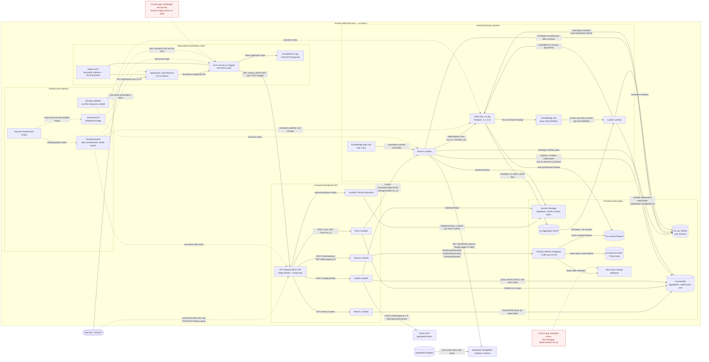

# Kallo Analytics Plane on AWS

## Solution architecture report — RMIT Cloud Computing Assessment 3

### Links

- **Live dashboard:** `[active during demo; ALB DNS changes per deployment — screenshots included]`
- **Source repository:** `[repository URL to be inserted before submission]`
- **Public datasets:** None. The project uses private, sanitised operational data from the live `kallo.fit` application; no public dataset is redistributed with the submission.

## 1. Summary (0.5 marks)

This project builds a low-cost analytics and operations plane for `kallo.fit`, a live calorie-tracking application whose production path runs on Google Cloud Run with Supabase Postgres. It extracts only seven privacy-reduced analytics views through Supabase PostgREST, lands incremental JSON Lines (JSONL) batches in Amazon S3, transforms them with AWS Glue into curated Parquet and dashboard aggregates, serves those aggregates through DynamoDB and API Gateway, and presents them in a Next.js dashboard on Amazon ECS Fargate behind an Application Load Balancer (ALB). The design is intentionally asynchronous and separate from the application's serving path, and it is bounded by the AWS Academy Learner Lab's service restrictions and USD 50 account budget.

## 2. Introduction (1 mark)

### 2.1 Motivation

The live `kallo.fit` application currently has no reporting surface for product engagement, food-data coverage or AI-pipeline health. Querying its operational Supabase tables from dashboard requests would add reporting load and failure modes to the production serving path. This project therefore copies an allowlisted, pseudonymised subset into an independent AWS analytics plane: a reporting failure can make the dashboard stale, but cannot prevent a user from logging a meal.

### 2.2 High-level view

At bird's-eye level, a daily or manually requested batch crosses the cloud boundary once: Lambda reads restricted Supabase views and writes a staged raw layer to S3; Glue converts the manifested batch to Parquet and twelve precomputed aggregate payloads; a success event invokes a loader that upserts DynamoDB. The dashboard normally reads those small aggregates, while Athena provides a separate fixed-template path for deeper SQL and Gemini turns seven days of aggregates into an on-demand operational brief. Figure 1 expands this overview and labels the actual service actions.

### 2.3 Beneficiaries

The direct beneficiary is the application operator/developer, who receives one place to inspect engagement, meal volume, model latency and failures, token cost, ingredient matching, onboarding conversion and food-data anomalies. Future contributors benefit from explicit view contracts, infrastructure as code, pure transformation functions and local tests. End users benefit indirectly when the operator uses coverage gaps and implausible nutrition records to correct the food catalogue and improve model or pipeline behaviour; the dashboard itself is not an end-user feature.

## 3. Related work (1 mark)

### 3.1 Self-hosted product analytics: PostHog

PostHog provides event capture, trends, funnels, retention, dashboards and SQL-style exploration, and its self-hosted distribution requires the operator to manage a multi-container analytics stack [1], [2]. It is broader and more interactive than this project, but its documented hobby deployment expects a substantially heavier persistent host and several data services. Kallo instead derives a small, domain-specific set of operational metrics from existing relational records, uses batch serverless processing, and avoids always-on analytics infrastructure to remain viable in Learner Lab.

### 3.2 Google Cloud BigQuery with Looker Studio

A conventional GCP-native solution would load or expose data in BigQuery and connect it directly to Looker Studio for exploration and visualisation [3]. That would minimise cross-cloud movement because the live application already runs on GCP, and it would provide a mature managed BI surface. This assessment deliberately demonstrates AWS services: a restricted PostgREST boundary performs cross-cloud extraction, a custom dashboard exposes the pipeline controls, and serverless/pay-per-request choices constrain idle cost rather than introducing another continuously provisioned store.

### 3.3 AWS serverless data-lake reference architectures

AWS's serverless data-lake guidance combines S3, Lambda, Glue, DynamoDB, event-driven orchestration and infrastructure as code, with catalogue and governance stages suitable for enterprise reuse [4]. Kallo adopts the raw/curated separation, Glue transformation and event-driven hand-off, but removes queues, Step Functions, CI/CD services and data-governance products that would be disproportionate for one operator and a USD 50 lab. Its extraction source is also outside AWS and its transform is deliberately capped at two G.1X workers for ten minutes.

### 3.4 Kimball-style batch ETL

Kimball's technical DW/BI architecture separates a back-room ETL environment from a front-room presentation area and normally exposes dimensionally structured atomic and aggregate data [5]. Kallo follows the separation of extraction/transformation from presentation and materialises stable metric grains, but it does not build a relational star schema or enterprise conformed dimensions. At this scale, curated Parquet plus purpose-built JSON aggregates and DynamoDB reads are cheaper and simpler; Athena retains a route for questions that do need SQL over the curated layer.

## 4. System architecture (5 marks)

### 4.1 Main architecture

**Figure 1. Implemented runtime and deployment topology.** Solid arrows are runtime calls or data movement; dotted arrows are deployment-time relationships. The two red notes are current repository limitations, not fabricated completed work. Mermaid flowchart notation follows [20].



The ALB DNS name is an output of the disposable presentation stack, so it changes when that stack is deleted and recreated. No URL or screenshot is asserted in this report before a real deployment. The current ALB/ECS port mismatch shown in Figure 1 must be corrected and demonstrated before the live link can truthfully be described as active.

### 4.2 Client-operation and scheduled sequences

#### Operation 1 — load the dashboard panels

1. The browser requests `/` from the public ALB. The ALB is configured to forward to the single Fargate task; the intended result is a dynamically rendered Next.js page for the latest 90-day UTC window.
2. During server rendering, Next.js starts twelve metric requests in parallel—`dau_wau`, `retention_cohorts`, `meal_volume`, `macro_distributions`, `top_foods`, `ai_latency`, `ai_failure_rate`, `token_cost_daily`, `match_rate`, `onboarding_funnel`, `coverage_gaps` and `implausible_foods`. These twelve payloads populate nine visual panels because engagement, AI health and coverage each combine two metrics.
3. Each `GET /metrics/{metric}?from=YYYY-MM-DD&to=YYYY-MM-DD` carries the server-held bearer token to API Gateway. The TOKEN authoriser compares it in constant time with the Secrets Manager value and, on success, returns both an Allow policy and the token as the usage-plan identifier.
4. API Gateway applies the stage limit (2 requests/second, burst 5) and monthly quota (10,000), then invokes the metrics Lambda. The Lambda rejects unknown metric names and invalid date ranges, and issues a DynamoDB `Query` against `metric = :metric AND date BETWEEN :from AND :to`—never a table scan.
5. Next.js merges daily payloads where necessary and renders every panel. `Promise.allSettled` preserves available panels if individual requests fail and displays an error banner. DAU/WAU and retention define an active user as a pseudonymous user who logged at least one meal on the relevant day.

**Implementation note.** The request fan-out is real source code, but twelve immediate calls exceed the API's burst limit of five unless API Gateway/Lambda timing spreads them. This requires deployment testing and may need client-side batching or a quota adjustment; it has not been represented as already proven.

#### Operation 2 — run the pipeline now (asynchronous run ID and polling)

1. The operator selects **Run pipeline now**. The browser posts to the Next.js same-origin route `/api/runs`, which sends `POST /runs` with the bearer token to API Gateway.
2. After authorisation and quota enforcement, the runs Lambda creates a UUID and invokes the extract Lambda with `InvocationType="Event"` and `{"mode":"on_demand","run_id":"…"}`. Asynchronous Lambda invocation queues the event and returns without waiting for extraction [12]; the API responds `202 {"run_id":"…"}`.
3. The extract Lambda writes `_run#<run_id>/latest` with phase `extracting`, performs the seven-view extraction, writes the manifest, starts Glue once, then replaces the phase with `transform_started` and records the Glue job-run ID when supplied.
4. The browser immediately polls once and then polls its same-origin `/api/runs/{run_id}` route every five seconds. The runs Lambda performs a DynamoDB `GetItem` on the run key and returns the current phase. There is a small accepted race in which an immediate poll can return 404 before the asynchronous extractor creates the first run record.
5. When Glue succeeds, EventBridge invokes the loader. After it validates every aggregate and upserts them, it updates the run to `completed`; the next poll stops the timer and displays success. Failed extract or Glue executions are visible in service logs, but the current run record has no automated terminal `failed` phase or dead-letter destination.

#### Operation 3 — ad-hoc Athena query

1. An authorised API client posts `{"template_id":"…","from":"YYYY-MM-DD","to":"YYYY-MM-DD"}` to `/athena/query`. The word *ad-hoc* here means choosing one of three fixed analytical templates and a date range; arbitrary client SQL is deliberately impossible.
2. The Athena Lambda validates the template identifier and ISO dates, inserts only validated `DATE` literals, then calls `StartQueryExecution` in the enforced workgroup. The implemented templates are macro percentiles, meals by preferred locale and latency percentiles.
3. The API returns `202 {"query_execution_id":"…"}`. The client polls `GET /athena/query/{id}`; the Lambda calls `GetQueryExecution` and, after `SUCCEEDED`, `GetQueryResults` for at most 100 rows. Athena writes its own result object beneath `athena-results/`, which expires after seven days [15]. The workgroup enforces its configuration and stops any query above 1 GiB scanned [9].
4. **Current implementation boundary:** the Lambda routes and fixed queries exist, but the Next.js dashboard exposes no Athena form or polling client. More importantly, CloudFormation creates the Glue database but no `AWS::Glue::Table` resources or crawler, so the referenced `v_meals`, `v_user_funnel` and `v_pipeline_runs` catalogue tables are not automatically available. This operation is therefore source-implemented but not end-to-end deployable from the present stacks.

#### Operation 4 — weekly Gemini insight

1. The operator selects **Generate summary**. The browser posts to the Next.js `/api/insight` route, which forwards `POST /insight/weekly` through the authenticated API.
2. The insight Lambda calculates the inclusive UTC range from today minus six days through today and issues DynamoDB `Query` calls for seven aggregate metrics: engagement, meal volume, latency, failure rate, token cost, match rate and coverage gaps.
3. It builds a compact JSON context and retrieves the Gemini key from Secrets Manager on the first invocation of a warm Lambda environment.
4. The Lambda calls `POST /v1beta/models/gemini-2.5-flash:generateContent` with a low-temperature prompt, a 300-token ceiling and a 25-second HTTP timeout. Gemini returns generated text at `candidates[0].content.parts[0].text`, matching the documented `generateContent` request/response model [18].
5. The text is returned to the browser and displayed, or a fixed 502 message is shown on a Gemini/network/response failure. “Weekly” describes the seven-day data window; the summary is generated on demand, is not scheduled weekly and is not persisted.

#### Operation 5 — unattended daily schedule

1. An enabled EventBridge rule with `rate(1 day)` invokes the extract Lambda. EventBridge, rather than the production application, owns the schedule.
2. The extractor generates a run UUID, reads the stored per-view watermark (except the full-refresh food-composition view), pages PostgREST, writes JSONL and advances a watermark only after that view completes. If any view raises an error, no manifest or Glue start is issued.
3. After all views finish, it writes `raw/_manifests/dt=<UTC-date>/manifest.json` and calls `StartJobRun` exactly once with `--run_id` and `--manifest_key`.
4. Glue reads only the manifest-listed files, verifies row counts, writes curated Parquet and twelve aggregate JSON objects, and completes. AWS Glue emits a state-change event directly to EventBridge [13].
5. The exact-job-name, `SUCCEEDED` rule invokes the loader. The loader recovers Glue arguments with `GetJobRun`, validates all aggregate objects before mutating DynamoDB, then uses deterministic `PutItem` writes at `(metric, date)` and marks the run complete. Replaying the same output replaces the same keys rather than creating duplicates.

### 4.3 AWS component choice and implementation evidence

| AWS service/component | Function in this project | Why appropriate at this scale | Implementation and automation evidence |
|---|---|---|---|
| AWS CloudFormation | Defines the probe, persistent data and disposable presentation stacks. | Repeatable teardown is essential in a temporary Learner Lab; separating the ALB/Fargate tier limits idle spend. | All three YAML templates exist. Deployment scripts call CloudFormation, but credentials, default-VPC IDs, image URI and secrets remain intentional operator inputs. |
| Amazon S3 | Stores raw JSONL, manifests, curated Parquet, aggregate JSON, Glue scripts and Athena results. | Durable object storage separates stages cheaply and lets Glue/Athena operate without a database server. | Bucket, encryption, public-access block and abort rules are automated; Athena results expire after seven days. Raw, curated and aggregate retention is not time-limited. |
| AWS Lambda | Runs extraction, loading, four API handlers and the TOKEN authoriser. | Short, event-driven control-plane work does not justify always-on hosts. Reserved concurrency (one each), memory and timeouts constrain cost. | Application ZIPs and handlers exist and are unit-tested; `deploy-data-stack.sh` replaces the template's seven inline placeholders after stack deployment. No DLQ or failed-run updater is configured. |
| Amazon EventBridge | Starts the daily extract and filters the named Glue job's `SUCCEEDED` event to the loader. | Native schedule and service-event routing avoids a polling server or workflow engine for this linear batch. | Both enabled rules and scoped Lambda permissions are in CloudFormation. Delivery is automated after deployment; the daily cadence is `rate(1 day)`, not a fixed UTC clock time. |
| AWS Glue ETL | Reads manifested raw JSON, writes partitioned Parquet and computes twelve aggregates. | Glue supplies managed Spark without EMR cluster provisioning [7], while columnar Parquet reduces later data movement and scan work [6]. EMR would add instance selection, cluster lifetime and idle-cost decisions for only thousands of rows; the job is bounded to two G.1X workers, one concurrent run and ten minutes. | Job, arguments and strict cost guards are automated; PySpark entrypoint and pure transforms exist. The code collects each small view to the driver, an explicitly scale-limited choice. |
| AWS Glue Data Catalog | Intended schema registry shared by Glue and Athena. | A catalogue is the native contract Athena uses to locate and type S3 data [10]. | The database is automated. **Not fully implemented:** no crawler or table definitions are present, so Athena's table names are unresolved after a clean deployment. |
| Amazon DynamoDB | Stores date-keyed aggregate payloads, extraction watermarks and run states. | The access patterns are key-value/range reads with no joins or transactions. On-demand capacity charges for requests instead of an idle relational instance [11], unlike RDS. | PAY_PER_REQUEST table and key schema are automated; extractor/loader/API code uses `GetItem`, `PutItem`, `UpdateItem` and `Query`. PITR is deliberately disabled; aggregate payloads are JSON strings. |
| Amazon Athena | Runs three asynchronous fixed-template SQL analyses over curated data. | Athena queries S3 in place and has no warehouse cluster to keep running [8], unlike Redshift. A workgroup-level 1 GiB cut-off and seven-day result expiry bound exploratory cost. | Workgroup and API handler are automated. **Not end-to-end:** catalogue tables and dashboard client are absent, as noted above. |
| Amazon API Gateway | Exposes metrics, run, Athena and insight routes with a regional REST endpoint. | Managed routing, Lambda proxy integration, throttling and quotas avoid operating an API server. | Resources, methods, CORS, deployment, stage, authoriser, API key and usage plan are defined. The 2 r/s, burst-5 configuration needs load-panel validation against twelve parallel calls. |
| AWS Secrets Manager | Holds Supabase credentials, Gemini key and dashboard bearer token. | Prevents secrets from entering source or container images and supports runtime retrieval/ECS secret injection. | Secret resources and environment references are automated; values are NoEcho deploy parameters. Rotation is manual, and the Supabase setup still requires a correctly scoped JWT/gateway key. |
| Amazon ECS | Maintains the desired count and lifecycle of the Next.js task. | The dashboard is a standalone Node container, better suited to a container service than splitting its server-rendered UI into Lambdas. | Cluster, task definition and one-task service are in the disposable stack. |
| AWS Fargate | Supplies serverless container capacity for the dashboard. | Removes EC2 instance management and uses the smallest specified 0.25-vCPU/512-MiB task. The stack can be deleted after each lab session. | Launch type, x86-64 runtime and public-IP networking are automated. **Not presently demonstrable:** task port 80 conflicts with the image's port 3000. |
| Elastic Load Balancing — Application Load Balancer | Provides the public HTTP entry point and task health routing. | CloudFront is unavailable in Learner Lab. ALB natively targets ECS `awsvpc` task IPs [14] and provides a session-only DNS name. | ALB, listener, IP target group and security groups are automated. The stack has no TLS certificate/domain, and the current target/container port must be reconciled. |
| Amazon ECR | Stores the `linux/amd64` dashboard image consumed by ECS. | Private, region-local image storage integrates with ECS and avoids an external image dependency. | `push-image.sh` creates the repository if required, builds and pushes with the operator's federated credentials, then records the URI locally. ECR is script-managed rather than CloudFormation-managed and is not deleted by `lab-down.sh`. |
| Amazon VPC / EC2 networking | Supplies the existing default VPC, two public subnets and security-group isolation. | Public task addressing avoids a NAT Gateway, whose fixed hourly cost is unsuitable for the budget. Task ingress is restricted to the ALB security group. | The presentation template creates only security groups and receives the existing VPC/subnets as parameters; it creates no VPC, NAT Gateway or endpoint. |
| Amazon CloudWatch | Receives ECS logs plus service metrics enabled for API Gateway, Athena and Glue. | Native logs and metrics are enough for a short demonstration without another monitoring platform. | A seven-day ECS log group is automated. No dashboards, metric alarms or explicit Lambda log-retention resources are defined, so observability is partial. |
| AWS IAM (`LabRole`) | Authorises Lambda, Glue, ECS tasks/execution and EventBridge targets. | Learner Lab prohibits creating roles and policies; using the supplied role is the only compliant approach. | Every role ARN references the existing `LabRole`; the templates contain no `AWS::IAM::Role` or `AWS::IAM::Policy`. Least-privilege policy design is therefore outside this repository's control. |

The assignment's “fully implemented and automated” criterion should therefore be claimed only for the source-controlled paths that are actually wired: scheduled/manual extraction, S3 landing, one Glue start, transformation, Glue-success loading, DynamoDB metric/run APIs, bearer authorisation, weekly insight and stack/script provisioning. A clean deployment still requires operator-supplied secrets and one-time Supabase configuration. Athena catalogue registration and the presentation port are known blockers, and an Athena dashboard control is absent. Those items require correction and captured deployment evidence before the whole solution can be labelled fully implemented.

### 4.4 Cost, security and failure boundaries

The persistent stack uses pay-per-request or per-invocation services. Glue is the largest burst risk and is constrained to two G.1X workers, a ten-minute timeout, no retries and one concurrent run. Athena enforces a 1 GiB per-query cut-off and result expiry. Each Lambda has reserved concurrency one; API Gateway adds a low request rate and quota. The presentation stack is deliberately disposable, with one smallest-size Fargate task, no NAT Gateway, no custom VPC and no CloudFront.

S3 blocks public access and encrypts objects with SSE-S3; DynamoDB encryption is enabled; secrets are runtime values rather than committed configuration. The API accepts only a static bearer token, and its authoriser uses constant-time comparison. This is suitable for a single-operator demonstration, not a multi-user production identity system: there is no per-user authorisation, HTTPS listener, web application firewall or automated secret rotation.

Failure isolation is strongest at the production boundary: analytics reads only restricted views and cannot write to production tables. Within the pipeline, watermarks are advanced per completed view before the whole manifest is published, so a later-view failure can leave earlier watermarks advanced without a corresponding Glue run; the next extraction will not re-read those earlier rows. Manifests and raw part keys also use one fixed path per date, so multiple same-day runs overwrite rather than retain distinct run objects. These are honest limitations of the current implementation.

## 5. System descriptions (1 mark)

The **Supabase analytics schema** is the privacy and authority boundary. Its migration creates a non-login `analytics_reader` role, seven security-definer read-only views and a one-row pepper table that the reader cannot access. **PostgREST** exposes those views over HTTPS after an operator adds the schema to Supabase's exposed schemas and mints the restricted JWT.

The **extract Lambda** owns incremental extraction. It has an exact per-view column configuration, reads range pages of 1,000, retries timeouts and 5xx errors up to four total attempts, writes one JSONL object per non-empty page, advances per-view watermarks, writes the manifest after all views, and invokes Glue once. The food-composition dimension is the only full-refresh view.

**S3** is the data lake and stage boundary. **Glue** reads the explicit manifest rather than discovering arbitrary raw objects, validates stated row counts, writes date-partitioned curated Parquet, and invokes pure Python transformations to produce the dashboard's twelve payloads. The **Glue-success EventBridge rule** prevents the loader from observing incomplete transform output.

The **loader Lambda** resolves the manifest from Glue job arguments, validates all JSON files before writing any, and idempotently replaces the `(metric, date)` records in **DynamoDB**. That table also holds watermarks and asynchronous run phases, keeping three small access patterns in one on-demand store.

**API Gateway** and the **authoriser Lambda** form the authenticated boundary. Separate metrics, runs, Athena and insight Lambdas keep permissions and failure behaviour conceptually isolated even though Learner Lab assigns the shared `LabRole`. **Athena** is the bounded SQL path over curated data; **Gemini** is called only with aggregate JSON, never raw user records.

The **Next.js dashboard** runs as a standalone x86-64 image in **ECS Fargate**. It renders nine panels from twelve DynamoDB metrics, proxies interactive browser actions through same-origin routes so the bearer token stays server-side, and uses bundled mock JSON only when `MOCK_API=1`. The **ALB** is the temporary public front door; **ECR** stores its image; **CloudWatch Logs** retains task logs for seven days.

## 6. Datasets, data structures and APIs (1 mark)

### 6.1 Sanitised analytics views

There are no public datasets. The SQL migration exposes only the following private operational views and explicit columns; extractor code repeats the same allowlists and never sends `SELECT *`.

| View | Allowlisted columns | Privacy and analytical purpose |
|---|---|---|
| `analytics.v_pipeline_runs` | `id`, `created_at`, `pipeline_version`, `model_call1`, `model_call2`, `total_ms`, `ingredient_count`, `matched_count`, `unmatched_count`, `retry_count`, `escalated`, `cache_hit_l4` | Operational model latency and matching counts; excludes captured meal input. |
| `analytics.v_budget_events` | `id`, `created_at`, `request_id`, `route`, `work_kind`, `provider`, `model`, `request_count`, `input_tokens`, `output_tokens`, `error_category` | Model usage, estimated cost and failures; contains no prompt or response bodies. |
| `analytics.v_meals` | `id`, `user_hash`, `logged_at`, `meal_slot`, `entry_mode`, `confidence_overall`, `calories_kcal`, `protein_g`, `carbohydrate_g`, `fat_g`, `fiber_g` | Replaces `user_id` with HMAC-SHA-256 using a dedicated pepper and truncates `logged_at` to the hour. Supports meal engagement and nutrition distributions. |
| `analytics.v_meal_items` | `id`, `meal_id`, `ingredient_name`, `food_composition_id`, `estimated_grams`, `match_confidence`, `cooking_method`, `created_at` | Supports top-food reporting. `ingredient_name` is retained because it is the analytic subject; no source PII flag currently exists, so the migration notes that a future flag must become an exclusion predicate. |
| `analytics.v_unmatched_ingredients` | `id`, `query_text`, `created_at` | Supports coverage-gap ranking. `query_text` is retained as a food name under the same future-PII-flag condition. |
| `analytics.v_user_funnel` | `user_hash`, `created_at`, `onboarding_step`, `onboarding_completed_at`, `goal`, `preferred_locale` | Uses the same HMAC so meals and sign-ups can be related without exporting the user ID; both timestamps are truncated to a day. |
| `analytics.v_food_composition` | `id`, `name_en`, `type_en`, `state`, `source_id`, `serving_size_g`, `calories_kcal`, `protein_g`, `carbohydrate_g`, `fat_g`, `fiber_g` | Small full-refresh reference view used for nutrition plausibility checks; contains no user data. |

The pepper is set once in `analytics.pepper`, never exported to AWS and never readable by `analytics_reader`. Stable HMAC values permit cohort joins without exposing raw identifiers. Excluded everywhere are email addresses, `raw_input`, free-text feedback, raw `user_id`, and exact timestamps where hour/day precision is enough.

### 6.2 S3 object layout

```text
s3://<analytics-bucket>/
├── raw/<view>/dt=YYYY-MM-DD/part-<page>.jsonl
├── raw/_manifests/dt=YYYY-MM-DD/manifest.json
├── curated/<view>/dt=YYYY-MM-DD/*.parquet
├── aggregates/dt=YYYY-MM-DD/<metric>.json
└── athena-results/<Athena-generated result objects>
```

Each manifest contains `run_id`, `started_at`, `finished_at`, and a `views` object whose entries contain `rows` and `files`. The aggregate directory contains twelve files matching the names listed in Section 4.2. Raw and curated objects are encrypted and private; only Athena results have an automated seven-day expiry. The code's same-date fixed keys mean the layout behaves as a latest-run-per-day partition, not a complete immutable run archive.

### 6.3 DynamoDB key and item structures

The table has string partition key `metric`, string sort key `date`, on-demand capacity and no secondary indexes.

```json
{"metric":"meal_volume","date":"2026-08-10","payload":"[{\"date\":\"2026-08-10\",...}]"}
{"metric":"_watermark#v_meals","date":"latest","watermark":"2026-08-10T12:00:00Z","cursor_column":"logged_at","updated_at":"..."}
{"metric":"_run#<uuid>","date":"latest","run_id":"<uuid>","phase":"transform_started","manifest_key":"...","glue_job_run_id":"..."}
```

Aggregate `payload` values are canonical JSON strings. Metrics use a date sort key so the API can `Query` a range; watermarks and runs use `latest` and are fetched by exact `GetItem`. Loader `PutItem` calls make a replay idempotent for the same metric/date. The table has encryption enabled, point-in-time recovery disabled and no TTL.

### 6.4 Dashboard API surface

| Method and path | Request | Response / AWS action |
|---|---|---|
| `GET /metrics/{metric}?from=&to=` | Supported metric plus ISO date range | `200` metric items from DynamoDB `Query`. |
| `POST /runs` | Empty body | `202 {"run_id":"…"}` after asynchronous Lambda `Invoke`. |
| `GET /runs/{run_id}` | Safe run identifier | `200` DynamoDB `GetItem` run record, or `404`. |
| `POST /athena/query` | Fixed `template_id`, `from`, `to` | `202 {"query_execution_id":"…"}` after `StartQueryExecution`. |
| `GET /athena/query/{id}` | Athena execution ID | State/statistics and, on success, up to 100 result rows. |
| `POST /insight/weekly` | Empty body | `200 {"summary":"…"}` after aggregate queries and Gemini, or a controlled error. |

All non-OPTIONS routes require `Authorization: Bearer <token>`. The authoriser's returned usage identifier selects the API key/usage plan, so the client does not send a second key.

### 6.5 Third-party API 1 — Supabase PostgREST

Supabase provides an automatically generated REST API over database objects and supports custom exposed schemas [16], [17]. The extractor calls one view at a time; the following sketch shows the implemented shape.

```http
GET https://<project>.supabase.co/rest/v1/v_meals
    ?select=id,user_hash,logged_at,meal_slot,entry_mode,confidence_overall,
            calories_kcal,protein_g,carbohydrate_g,fat_g,fiber_g
    &order=logged_at.asc
    &logged_at=gt.<watermark>
Accept-Profile: analytics
Authorization: Bearer <restricted analytics JWT>
apikey: <Supabase gateway API key>
Range-Unit: items
Range: 0-999
```

```json
[
  {
    "id": "<meal-id>",
    "user_hash": "<64-character HMAC hex>",
    "logged_at": "2026-08-10T12:00:00+00:00",
    "meal_slot": "lunch",
    "entry_mode": "text",
    "confidence_overall": 0.91,
    "calories_kcal": 540,
    "protein_g": 24,
    "carbohydrate_g": 66,
    "fat_g": 18,
    "fiber_g": 5
  }
]
```

Success may be HTTP 200 or 206. The loop stops after a short page; timeouts and 5xx responses back off and retry, while 4xx and malformed JSON fail the view. The handler accepts a JSON secret that can hold distinct `analytics_jwt` and `api_key` values, although the current CloudFormation parameter stores only `url` and `key` and therefore uses that one value for both headers. A deployment using a distinct modern Supabase gateway key must store the richer secret manually or extend the template.

### 6.6 Third-party API 2 — Gemini `generateContent`

The insight Lambda sends only the compact seven-metric aggregate context, not raw or row-level records. Authentication uses the `x-goog-api-key` header as documented by Google [18], [19].

```http
POST https://generativelanguage.googleapis.com/v1beta/models/
     gemini-2.5-flash:generateContent
Content-Type: application/json
x-goog-api-key: <secret>
```

```json
{
  "contents": [
    {"role": "user", "parts": [{"text": "<instructions and aggregate JSON>"}]}
  ],
  "generationConfig": {"temperature": 0.2, "maxOutputTokens": 300}
}
```

```json
{
  "candidates": [
    {"content": {"parts": [{"text": "<weekly operations summary>"}]}}
  ],
  "usageMetadata": {"promptTokenCount": 0, "candidatesTokenCount": 0}
}
```

The code reads the first candidate text and rejects an absent, empty or non-success response. The response sketch uses zeroes only as structural placeholders; it is not claimed as an observed response.

## 7. References (0.5 marks)

[1] PostHog, “Product analytics,” *PostHog Documentation*. [Online]. Available: https://posthog.com/docs/product-analytics. [Accessed: 11 Aug. 2026].

[2] PostHog, “Self-host PostHog,” *PostHog Documentation*. [Online]. Available: https://posthog.com/docs/self-host. [Accessed: 11 Aug. 2026].

[3] Google Cloud, “BigQuery integrations,” *Looker Studio Documentation*. [Online]. Available: https://docs.cloud.google.com/looker/docs/studio/bigquery-integrations. [Accessed: 11 Aug. 2026].

[4] K. Chandrashekar and A. Jaidi, “Deploy and manage a serverless data lake on the AWS Cloud by using infrastructure as code,” *AWS Prescriptive Guidance*. [Online]. Available: https://docs.aws.amazon.com/prescriptive-guidance/latest/patterns/deploy-and-manage-a-serverless-data-lake-on-the-aws-cloud-by-using-infrastructure-as-code.html. [Accessed: 11 Aug. 2026].

[5] Kimball Group, “Kimball Technical DW/BI System Architecture.” [Online]. Available: https://www.kimballgroup.com/data-warehouse-business-intelligence-resources/kimball-techniques/technical-dw-bi-system-architecture/. [Accessed: 11 Aug. 2026].

[6] Amazon Web Services, “Best practices,” *Getting Started with Serverless ETL on AWS Glue*. [Online]. Available: https://docs.aws.amazon.com/prescriptive-guidance/latest/serverless-etl-aws-glue/best-practices.html. [Accessed: 11 Aug. 2026].

[7] Amazon Web Services, “AWS Glue: How it works,” *AWS Glue Developer Guide*. [Online]. Available: https://docs.aws.amazon.com/glue/latest/dg/how-it-works.html. [Accessed: 11 Aug. 2026].

[8] Amazon Web Services, “Amazon Athena Documentation.” [Online]. Available: https://docs.aws.amazon.com/athena/. [Accessed: 11 Aug. 2026].

[9] Amazon Web Services, “Use workgroups to control query access and costs,” *Amazon Athena User Guide*. [Online]. Available: https://docs.aws.amazon.com/athena/latest/ug/workgroups-manage-queries-control-costs.html. [Accessed: 11 Aug. 2026].

[10] Amazon Web Services, “Understanding tables, databases, and data catalogs in Athena,” *Amazon Athena User Guide*. [Online]. Available: https://docs.aws.amazon.com/athena/latest/ug/understanding-tables-databases-and-the-data-catalog.html. [Accessed: 11 Aug. 2026].

[11] Amazon Web Services, “DynamoDB on-demand capacity mode,” *Amazon DynamoDB Developer Guide*. [Online]. Available: https://docs.aws.amazon.com/amazondynamodb/latest/developerguide/on-demand-capacity-mode.html. [Accessed: 11 Aug. 2026].

[12] Amazon Web Services, “Invoking a Lambda function asynchronously,” *AWS Lambda Developer Guide*. [Online]. Available: https://docs.aws.amazon.com/lambda/latest/dg/invocation-async.html. [Accessed: 11 Aug. 2026].

[13] Amazon Web Services, “AWS Glue events,” *Amazon EventBridge Events Reference*. [Online]. Available: https://docs.aws.amazon.com/eventbridge/latest/ref/events-ref-glue.html. [Accessed: 11 Aug. 2026].

[14] Amazon Web Services, “Use an Application Load Balancer for Amazon ECS,” *Amazon ECS Developer Guide*. [Online]. Available: https://docs.aws.amazon.com/AmazonECS/latest/developerguide/alb.html. [Accessed: 11 Aug. 2026].

[15] Amazon Web Services, “Work with query results and recent queries,” *Amazon Athena User Guide*. [Online]. Available: https://docs.aws.amazon.com/athena/latest/ug/querying.html. [Accessed: 11 Aug. 2026].

[16] Supabase, “Auto-generated REST API via PostgREST.” [Online]. Available: https://supabase.com/features/auto-generated-rest-api. [Accessed: 11 Aug. 2026].

[17] Supabase, “Using custom schemas,” *Supabase Documentation*. [Online]. Available: https://supabase.com/docs/guides/api/using-custom-schemas. [Accessed: 11 Aug. 2026].

[18] Google, “Gemini API reference,” *Google AI for Developers*. [Online]. Available: https://ai.google.dev/api. [Accessed: 11 Aug. 2026].

[19] Google, “Generating content,” *Gemini API*. [Online]. Available: https://ai.google.dev/api/generate-content. [Accessed: 11 Aug. 2026].

[20] Mermaid, “Flowcharts — Basic Syntax,” *Mermaid Documentation*. [Online]. Available: https://mermaid.js.org/syntax/flowchart.html. [Accessed: 11 Aug. 2026].
